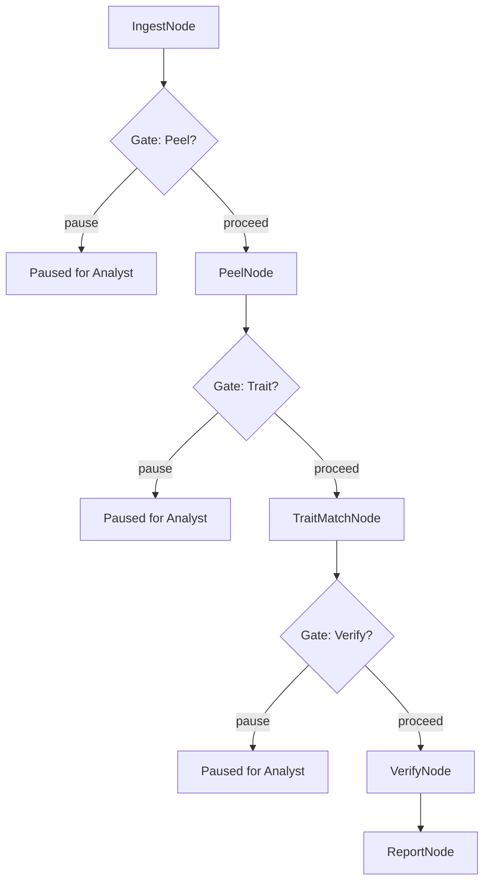
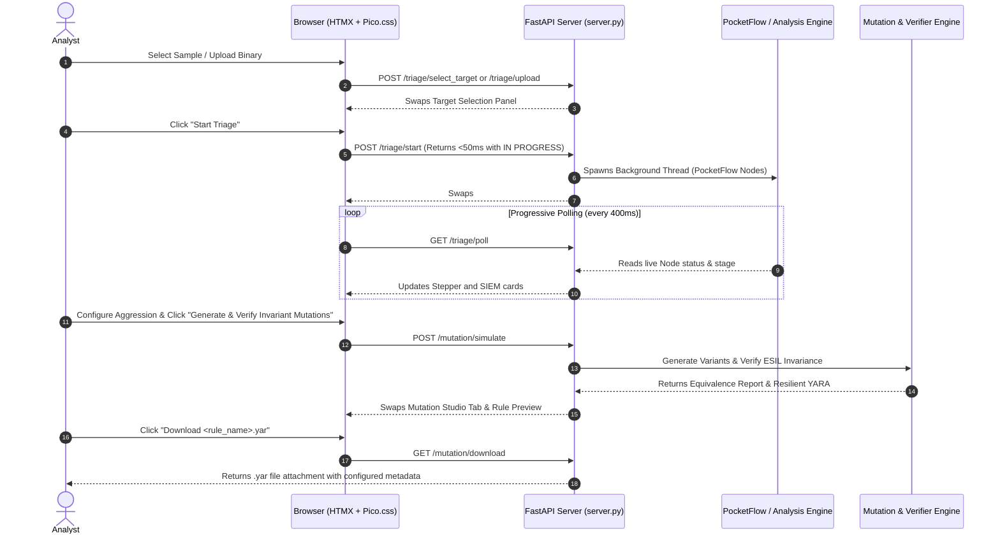

# BrundleX System Architecture & Design

## 1. Overview and Core Philosophy
BrundleX is an agentic, open-source malware analysis and trait-simulation workbench. It integrates:
* **Binary Refinery:** Automated peeling of crypters, XOR wrappers, and multi-stage payload extractors.
* **Binlex:** Genetic disassembly, extraction of instruction chromosomes, library noise reduction, and MinHash/TLSH trait clustering.
* **Radare2 (`r2pipe`):** Control Flow Graph (CFG) analysis, function boundary identification, and ESIL (Evaluable Strings Intermediate Language) emulation.
* **PocketFlow State Machine:** Multi-node guided workflow chaining ingest, deobfuscation, genetic attribution, verification, mutation simulation, and YARA rule synthesis with human-in-the-loop analyst gates.
* **FastAPI + HTMX + Pico.css UI:** Responsive, server-driven, single-page analyst workbench with zero custom JavaScript.

---

## 1.1 The Genetic Metaphor & Theoretical Foundation

The conceptual framework of BrundleX unites the genetic traits architecture pioneered by `binlex` (authored by @c3rb3ru5d3d53c) with evolutionary code simulation:

1. **Chromosomes as Operational Primitives**:
   In binary genetics, a basic block or function with volatile address offsets and operand offsets masked (`??`) is treated as a **chromosome**. Just as DNA sequences code for specific biological proteins, code chromosomes encode specific machine behaviors (e.g. XOR decryption, dynamic API resolution via PEB walking, RC4 scheduling).
2. **Genetic Heritage & Lineage Drift**:
   Adversary development rarely starts from scratch; threat groups routinely fork source code, purchase builder toolkits, or share modules. Lineage drift occurs as developers adjust constants, swap registers, or change compilation settings. `binlex` allows BrundleX to measure this lineage distance mathematically using MinHash Jaccard similarity and TLSH locality-sensitive matching.
3. **The Harvester as Genetic Sequencer**:
   The Harvester acts as an automated sequencing pipeline, pulling raw threat specimens from the wild, passing them through an entropy quality filter, and isolating recurring ancestral chromosomes in `data/traits.db`.
4. **Predictive Mutation as Directed Evolutionary Simulation**:
   Where static analysis looks backward at past samples, BrundleX's Mutation Studio looks forward. By subjecting isolated decryptor chromosomes to semantic mutations (register substitutions, peephole instruction swaps, hazard-safe permutations) and proving behavioral invariance via Radare2 ESIL emulation, BrundleX explores the future evolutionary space of the threat strain.
5. **Proactive YARA Synthesis**:
   Aligning the mutant genomes allows BrundleX to synthesize resilient YARA rules that anchor invariant operational opcodes while wildcarding volatile registers and constants—detecting adversary mutations before they are compiled and deployed.

---

## 2. Environment and Isolation Boundaries
To prevent accidental infection, host contamination, and dependency drift:
1. **Container Isolation (Podman/Docker):** The core analysis engine, tool wrappers, and dependencies execute inside a locked-down container (`Containerfile`).
2. **Network Sandbox:** Network access during sample peeling, disassembly, and emulation is strictly prohibited. External requests are limited to the harvester (fetching metadata/samples from MalwareBazaar) and LLM API calls.
3. **Storage Lifecycle:** Raw binaries and extracted scratch stages are managed with strict lifecycles in `/tmp` and wiped immediately after trait indexing or session conclusion.

---

## 3. Core Subsystems

### 3.1 Data Harvester Subsystem (`src/harvester/` & `tools/harvest_traits.py`)

#### Trait Quality & Noise Filtration
- **Trivial-Block Elimination**: Binlex outputs thousands of small 1-2 instruction blocks (e.g., standard compiler epilogues `pop rbp; ret`, `nop; ret`). BrundleX enforces an instruction threshold (`instructions >= 3`) on basic blocks during ingestion, pruning generic compiler boilerplate and improving Jaccard similarity confidence.
- **Headerless Raw Fallback**: If an unmapped or headerless payload (e.g., raw carved shellcode or memory inject from Binary Refinery) produces 0 traits under `mode="auto"`, BrundleX automatically re-runs extraction with architecture fallbacks (`raw:x86_64`, `raw:x86`).
- **Graph Complexity Scoring**: Binlex computes **Cyclomatic Complexity ($CC$)**, edges, and Shannon entropy for every basic block. BrundleX harnesses this metadata to automatically prioritize decryptor routines ($CC = 1$ to $3$, high instruction density, high entropy) and rank candidate blocks for simulation in the Mutation Studio.

* **Objective:** Ingest and index high-confidence genetic chromosomes and basic-block traits into `data/traits.db` without local disk contamination or crypter noise.
* **Architecture & Mechanics:**
  1. **Query API:** Queries MalwareBazaar API (`MalwareBazaarClient`) targeting tags (e.g. `tag:unpacked`, `tag:payload`) or threat signatures/families (e.g. `signature:Stealc`, `signature:LummaStealer`).
  2. **In-Memory Streaming:** Sample ZIPs are streamed directly into RAM (`io.BytesIO`) using standard MalwareBazaar encryption password (`b"infected"`).
  3. **Ephemeral Staging:** Unzipped into temporary scratch storage (`/tmp/<sha256>`).
  4. **Shannon Entropy Gatekeeper ($H$):**
     - Calculates Shannon entropy across byte distribution:
       $$H(X) = -\sum_{i=1}^{n} P(x_i) \log_2 P(x_i)$$
     - If $H > 7.1$ (or user-configured threshold), the sample is discarded as packed/crypted to protect the database from opaque noise.
  5. **Genetic Trait Extraction (`binlex`):**
     - Disassembles executable sections.
     - Strips known runtime library noise (standard CRT, OpenSSL, Go runtime primitives).
     - Extracts basic-block chromosomes, MinHash fingerprints, and TLSH locality-sensitive hashes.
  6. **Storage & Auto-Purge:** Inserts records into SQLite (`data/traits.db`). Ephemeral file `/tmp/<sha256>` is guaranteed purged immediately via `try...finally`.
* **Execution Modes:**
  - **Web Studio UI:** In the sidebar under **Genetic Threat DB**, expand **Harvester Ingest Settings** to tune Family, Tag, Sample Limit, and Max Entropy.
  - **CLI Batch Operation:** `python3 tools/harvest_traits.py --family <name> --limit <N> --max-entropy 7.1` for batch ingestion from MalwareBazaar.

### 3.2 Orchestration Layer (`pocketflow`)
* **Design Pattern:** Directed Acyclic Graph (DAG) state machine with Human-in-the-Loop Analyst Checkpoint Gates.
* **Core Abstractions (`pocketflow`):**
  * `pocketflow.Node`: Standardized 3-step lifecycle:
    * `prep(self, shared) -> prep_res`: Pure read from `shared` store.
    * `exec(self, prep_res) -> exec_res`: Pure compute/tool invocation, isolated from `shared`, with automated retries (`max_retries`, `wait`) and graceful fallback (`exec_fallback`).
    * `post(self, shared, prep_res, exec_res) -> action`: Mutates `shared` store and returns action string (`"default"`, `"proceed"`, `"pause"`, `"error"`).
  * `pocketflow.Flow`: Graph orchestrator linking nodes using `>>` and conditional branching `- "action" >>`.
* **Nodes:**
  * `IngestNode`: Format detection (PE/ELF/MACHO), SHA-256 / SHA-1 / MD5 calculation, and Shannon entropy computation.
  * `AnalystGateNode`: Configurable human-in-the-loop approval gate. Pauses flow when unapproved (`"pause"`) or continues (`"proceed"`).
  * `PeelNode`: Deobfuscation via Binary Refinery (overlay stripping, single-byte XOR key scanning, PE carving).
  * `TraitMatchNode`: Binlex trait extraction and SQLite similarity scoring against `data/traits.db`.
  * `VerifyNode`: Radare2 headless disassembly, basic block CFG, and ESIL emulation.
  * `ReportNode`: Prompt-engineered synthesis via OpenAI-compatible endpoint with failover and heuristic attribution fallback.



### 3.3 Predictive Mutation Engine & Reverse Engineering Lingo (`src/mutation/`)
* **Objective:** Generate semantically identical instruction variants of basic blocks (such as decryptor stubs) to test signature resilience before threat actors deploy updated variants.
* **Core Concepts & RE Terminology:**
  * **Basic Block:** A straight-line code sequence with one entry and one exit, without internal branching. Decryption loops typically execute within tight basic blocks.
  * **Semantic Equivalence:** Code sequences that look completely different in assembly or raw opcodes, but produce identical side-effects on CPU registers and memory.
  * **Peephole Optimization / Semantic Swaps:** A sliding-window pattern replacement substituting known algebraic or mnemonic equivalents:
    - Zeroing registers: `xor rcx, rcx` $\longleftrightarrow$ `mov rcx, 0` $\longleftrightarrow$ `sub rcx, rcx`
    - Arithmetic scaling: `add rax, 1` $\longleftrightarrow$ `inc rax`
    - Counter decrement: `sub rdx, 1` $\longleftrightarrow$ `dec rdx`
    - Condition test: `test rbx, rbx` $\longleftrightarrow$ `or rbx, rbx`
  * **Non-Volatile Register Substitution:**
    - Safely replaces general-purpose registers (e.g. mapping `rax` $\rightarrow$ `r8` or `rcx` $\rightarrow$ `rdx`).
    - **Protected Register Invariance:** Preserves stack and control registers (`rsp`, `rbp`, `rip`) to strictly prevent stack misalignment or memory corruption.
  * **Hazard Dependency Analysis (Instruction Permutations):**
    - Instructions within a basic block are reordered only if their data dependencies do not clash:
      - **RAW (Read-After-Write):** Instruction 2 reads what Instruction 1 writes (true dependency).
      - **WAR (Write-After-Read):** Instruction 2 writes what Instruction 1 reads (anti-dependency).
      - **WAW (Write-After-Write):** Both instructions write to the same register (output dependency).
      - **Memory & Flow Fences:** Instructions referencing memory pointers (`[...]`) or control transfers (`call`, `jmp`, `ret`) are preserved in place.
  * **Radare2 ESIL Invariance Verification (`src/mutation/verifier.py`):**
    - Emulates both original and mutant assembly blocks under identical initial CPU states within Radare2's ESIL VM.
    - Computes hash digests of final register values and flags. If hashes match 100%, the variant is certified invariant (`is_esil_invariant = True`).
  * **Resilient YARA Synthesis (`src/mutation/yara_generator.py`):**
    - Aligns bytecode sequences across all certified mutants.
    - Dynamically generates `??` wildcards for divergent operand/register bytes while anchoring invariant opcode bytes.
* **Aggression & Variant Controls:**
  - **Aggression Level 1:** Single conservative peephole swap or register substitution.
  - **Aggression Level 2 - 3:** Combined peephole substitutions and independent instruction permutations.
  - **Aggression Level 4 - 5:** Multi-operator synthesis combining simultaneous register reallocations, multi-instruction reordering, and compound peepholes.
  - **Variant Count (1 to 5):** Number of distinct synthetic basic-block permutations to simulate, verify, and incorporate into the resulting YARA rule.

---

## 4. Data Models and Schemas

### 4.1 Genetic Threat Database Architecture (`data/traits.db`)

#### Holistic Role in Pipeline Operations
The SQLite threat database acts as the genetic reference library linking all subsystems:
1. **Harvester Ingestion**: Samples harvested from MalwareBazaar are parsed with `binlex` to populate normalized opcode chromosomes, TLSH hashes, and MinHash signatures grouped by malware family.
2. **Triage Jaccard Scoring**: During PocketFlow execution (`TraitMatchNode`), extracted traits from an incoming peeled binary are compared against the DB using Jaccard set similarity. Overlaps $\ge 25\%$ pinpoint the family attribution and isolate the critical decryptor/unpacking blocks.
3. **Seed for Predictive Mutation**: Identified basic blocks are handed off to Mutation Studio. Radare2 ESIL proves algebraic/semantic invariance across synthesized instruction variations, generating resilient YARA rules.
4. **Corpus Maintenance & Purge**: Database maintenance functions support complete table purges via `clear_database()` (`DELETE FROM traits; DELETE FROM samples; VACUUM;`), resetting the corpus when an analyst pivots between distinct campaign investigations.

### 4.1 SQLite Schema (`data/traits.db`)

```sql
CREATE TABLE IF NOT EXISTS samples (\n    sha256 TEXT PRIMARY KEY,\n    family TEXT NOT NULL,\n    first_seen TEXT,\n    entropy REAL,\n    source TEXT DEFAULT 'malwarebazaar'\n);\n\nCREATE TABLE IF NOT EXISTS traits (\n    id INTEGER PRIMARY KEY AUTOINCREMENT,\n    sample_sha256 TEXT NOT NULL,\n    trait_type TEXT NOT NULL, -- 'function', 'block', 'instruction'\n    tlsh_hash TEXT,\n    minhash TEXT,\n    chromosome_bytes TEXT NOT NULL, -- Wildcarded byte sequence (hex)\n    is_library INTEGER DEFAULT 0,   -- 1 = CRT/OpenSSL/Go runtime noise\n    FOREIGN KEY(sample_sha256) REFERENCES samples(sha256) ON DELETE CASCADE\n);\n\nCREATE INDEX IF NOT EXISTS idx_traits_tlsh ON traits(tlsh_hash);\nCREATE INDEX IF NOT EXISTS idx_traits_family ON samples(family);\n```

### 4.2 PocketFlow Shared Store Contract (`AnalysisState`)

```python
shared = {
    "sample_path": str,
    "active_payload_path": str,
    "sample_sha256": str,
    "sample_sha1": str,
    "sample_md5": str,
    "file_format": str,  # 'PE', 'ELF', 'MACHO', 'UNKNOWN'
    "file_size": int,
    "entropy": float,
    "current_stage": str,  # 'init', 'ingest', 'peel', 'trait_match', 'verify', 'report'
    "status": NodeStatus,  # 'pending', 'in_progress', 'completed', 'failed', 'paused_at_gate'
    "error_message": Optional[str],
    "paused_gate_name": Optional[str],
    "peeled_layers": List[Dict[str, Any]],
    "genetic_matches": List[Dict[str, Any]],
    "traits_extracted_count": int,
    "candidate_blocks": List[Dict[str, Any]],  # Top decryptor blocks ranked by cyclomatic complexity and entropy
    "radare_verification": Dict[str, Any],
    "analyst_decisions": List[Dict[str, Any]],
    "require_approval_gates": Dict[str, bool],
    "gate_approvals": Dict[str, Dict[str, Any]],
    "llm_verdict": Dict[str, Any],
    "final_report": Optional[str],
    "execution_log": List[str],
}
```

---

## 5. UI/UX Architecture & Layout (FastAPI + HTMX + Pico.css)

### 5.1 Architectural Principles
* **Zero Custom JavaScript:** Entire UI interactivity is driven exclusively by HTMX hypermedia controls and Pico CSS v2 styling.
* **Server-Driven Single-Page State:** The client triggers lightweight HTTP actions (`POST /triage/start`, `POST /triage/approve`, `POST /triage/harvest`, `POST /mutation/simulate`, `POST /triage/upload`, `POST /sample/pin`), and FastAPI returns updated server-rendered partials/documents with instant swap.
* **Instant Theme Switching & Accessibility:** Direct-action navigation anchor with HTTP 303 PRG, providing instant re-renders between dark mode and warm cream light mode without DOM reloads.

```
+------------------------------------------------------------------------------------------+
| Header: BrundleX Triage & Mutation Studio                   [Theme Mode Toggle]          |
+------------------------------------+-----------------------------------------------------+
| Target Binary Hashes (SHA256,1,MD5)| Telemetry: Attributed Family | Confidence | Status  |
+------------------------------------+-----------------------------------------------------+
| Sidebar Controls (330px fixed)     | Studio & Triage Pane (Dynamic Grid)                 |
| * Direct Local Binary Upload       | * Left: Analyst Dialogue & PocketFlow Stepper       |
| * Presets / Pinned Sample Selector | * Right Tabs:                                       |
| * Dynamic Custom Path Entry        |   - Genetic Lineage (Attribution & Trait Overlap)   |
| * Analyst Checkpoint Gates Toggles |   - Disassembly & ESIL (CFG & Register Trace)       |
| * Run Pipeline & Reset Action      |   - Mutation Studio (Basic Block Sim & YARA Synth)  |
    - Triage Report (Executive Summary & Capabilities)    |
+------------------------------------+-----------------------------------------------------+
```

### 5.2 Interactive Event Flow


---

## 6. Local LLM Integration

* **Interface:** Standard OpenAI-compatible HTTP endpoint (`POST /v1/chat/completions`).
* **Target Backends:** Remote or local endpoints (Ollama, LM Studio, vLLM, NVIDIA NIM) with automatic primary-to-fallback failover.
* **Prompt Strategy:** Single-responsibility prompts per PocketFlow node returning strict JSON objects.

---

## 7. Catalog of Failure Modes & Resilience Strategies

| Subsystem | Failure Mode ID | Risk / Symptom | Detection & Root Cause | Mitigation & Recovery |
| :--- | :--- | :--- | :--- | :--- |
| **Harvester** | `FM-HARV-01` | MalwareBazaar API rate limit or network partition | HTTP 429/500 or timeout during sample download | Harvester logs warning, backs off with exponential jitter, and skips to cached offline samples. |
| **Harvester** | `FM-HARV-02` | Corrupt or non-standard ZIP archive | `pyzipper.BadZipFile` or CRC mismatch | Ephemeral extract catches exception, purges `/tmp/<sha256>`, and records failed ingest. |
| **Gatekeeper** | `FM-GATE-01` | Packed or high-entropy sample slipped into trait DB | Shannon entropy $H > 7.1$ or UPX/Crypter section tags | Automated entropy threshold rejection. Discards sample before `binlex` chromosome extraction. |
| **Refinery** | `FM-PEEL-01` | Corrupt overlay or invalid XOR key | Binary Refinery pipeline returns empty or non-executable bytes | Fallback to original raw bytes; flags unpeeled layer in `AnalysisState.peeled_layers`. |
| **Binlex** | `FM-TRAIT-01` | Non-PE/ELF or zero traits extracted | Obfuscated or stripped binary produces 0 functions | Sets `traits_extracted_count = 0` and triggers fallback heuristic feature extraction. |
| **Radare2** | `FM-VERIF-01` | ESIL emulation timeout or crash | Infinite loop in malware decryption routine or unsupported instruction | Capped emulation step counter (max 500 steps) and graceful timeout fallback. |
| **LLM Client** | `FM-LLM-01` | Remote API failure or token limit exceeded | OpenAI endpoint 5xx or connection error | Automatic failover to secondary configured endpoint or heuristic template fallback. |
| **Mutation** | `FM-MUT-01` | Generated variant alters register semantics | ESIL post-state register hash differs from original block | Verifier flags `Status: FAILED`, excludes variant from YARA generation, and logs divergence. |
| **YARA Gen** | `FM-YARA-01` | Over-wildcarding leading to false positives | Masking creates string shorter than 4 contiguous specific bytes | Enforces minimum specific byte density threshold before issuing wildcards. |
| **Web UI** | `FM-UI-01` | State desynchronization between tabs | Stale session context on parallel tab operations | Centralized, thread-safe session context object in `server.py` with idempotent actions. |
| **Web UI** | `FM-UI-02` | Theme toggle failing dynamic repaint | Client DOM parser refusing top-level document replacement | Server returns HTTP 303 Redirect to `/` for clean document re-render with target theme. |
| **Web UI** | `FM-UI-03` | Container mount filesystem permissions (`:Z` vs host) | SQLite `OperationalError: unable to open database file` | Makefile container runtime configured with `--security-opt label=disable`. |
